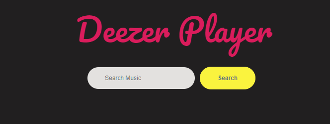
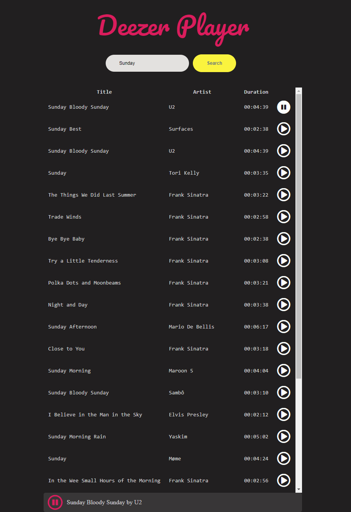

# Deezer Player
Welcome to Deezer Player!

Deezer Player enables the users to search for music and play short preview of it.
The application uses [RapidAPI](https://rapidapi.com/) in order to access [Deezer's](https://www.deezer.com/) API.

# Framework
For building the application [react](https://reactjs.org/) framework is used.

Playing music is implemented using [Web Audio API](https://developer.mozilla.org/en-US/docs/Web/API/Web_Audio_API)

# How to run locally
In order to build locally, dependencies need to be installed firstly. This can be done using [yarn](https://yarnpkg.com/) or [npm](https://www.npmjs.com/). The examples here are using yarn.

## Setting RapidAPI Key
In order to use your own API key for RapidAPI firstly you have to obtain one from their [website](https://rapidapi.com/). Then, in the root folder of the project create a file called ```.env``` and add:

```REACT_APP_RAPID_API_KEY=<API key>```

where <API key> should be replaced with your key.

## Installing dependencies
```yarn install```

## Starting the server
```yarn start```

This will start a server on default port **3000**. To access the application open [http://loclahost:3000](http://loclahost:3000) in the browser.

# How to deploy
In order to deploy the application needs to be built firstly:
```yarn build```

This will create a new directory called **build**. The content of this folder can be directly copied to a web server.

# How to use
 When application is loaded an initial screen is shown where users can search for music:
 
 
 
 After search is performed the results are shown and music can be played:
 
 
 
 Enjoy! :)
